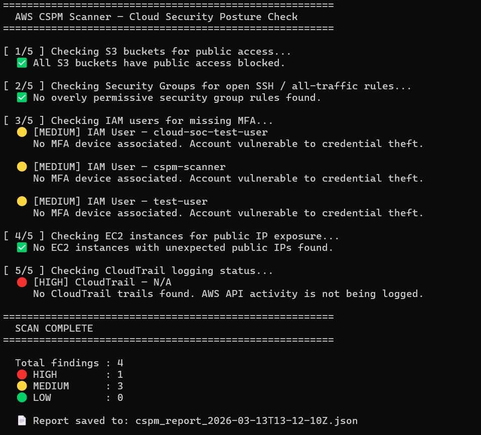
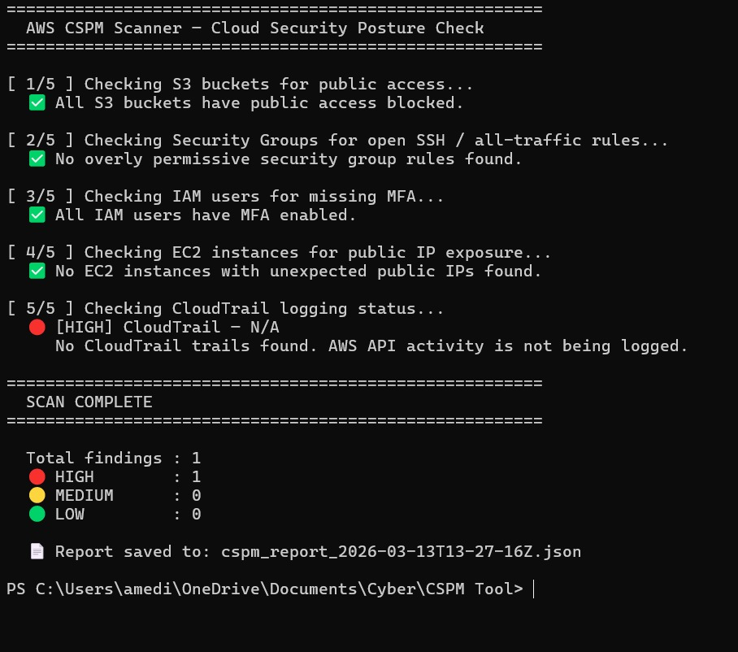
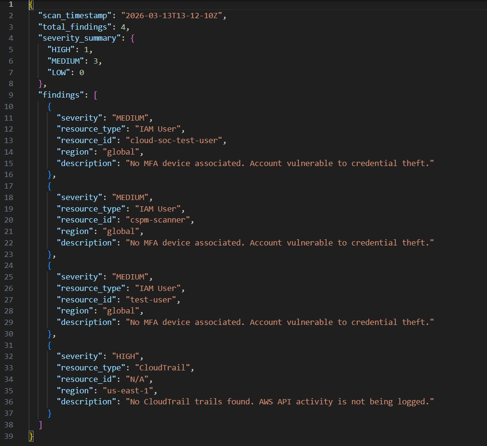

# AWS Cloud Security Posture Management (CSPM) Tool


## Overview

A Python-based automated cloud security scanner that audits an AWS environment for common misconfigurations and security risks. The tool checks five critical security controls, generates a severity-rated terminal report, and saves a timestamped JSON report for documentation and further analysis.

This project simulates the kind of posture assessment performed by tools like AWS Security Hub or commercial CSPM platforms — built from scratch using Python and Boto3.

---

## Features

- Automated scanning of 5 AWS security controls
- Severity-rated findings: HIGH / MEDIUM / LOW
- Color-coded terminal output for quick triage
- Timestamped JSON report saved automatically
- Lightweight — runs locally with read-only AWS credentials

---

## Security Checks

| # | Check | Severity |
|---|-------|----------|
| 1 | S3 buckets with public access enabled | HIGH |
| 2 | Security groups with SSH (port 22) or all-traffic open to 0.0.0.0/0 | HIGH |
| 3 | IAM users without MFA enabled | MEDIUM |
| 4 | EC2 instances with public IP addresses exposed | MEDIUM |
| 5 | CloudTrail logging disabled or no trails configured | HIGH |

---

## Tools & Technologies

- **Language:** Python 3
- **AWS SDK:** Boto3
- **Services Scanned:** S3, EC2, IAM, CloudTrail, Security Groups
- **Output:** Terminal + JSON report

---

## Prerequisites

- Python 3.x installed
- AWS CLI installed and configured
- AWS IAM user with `SecurityAudit` policy attached (read-only)

---

## Setup & Usage

**1. Install dependencies**
```bash
pip install boto3
```

**2. Configure AWS credentials**
```bash
aws configure
```
Enter your Access Key ID, Secret Access Key, region (e.g. `ap-south-1`), and output format (`json`).

**3. Set your region in the script**

Open `cspm_scanner.py` and update:
```python
REGION = "ap-south-1"  # change to your AWS region
```

**4. Run the scanner**
```bash
python cspm_scanner.py
```

---

## Sample Output

**Before remediation (initial scan):**
```
[ 1/5 ] Checking S3 buckets for public access...
  ✅ All S3 buckets have public access blocked.

[ 2/5 ] Checking Security Groups for open SSH / all-traffic rules...
  ✅ No overly permissive security group rules found.

[ 3/5 ] Checking IAM users for missing MFA...
  🟡 [MEDIUM] IAM User — cloud-soc-test-user
     No MFA device associated. Account vulnerable to credential theft.

  🟡 [MEDIUM] IAM User — cspm-scanner
     No MFA device associated. Account vulnerable to credential theft.

  🟡 [MEDIUM] IAM User — test-user
     No MFA device associated. Account vulnerable to credential theft.

[ 4/5 ] Checking EC2 instances for public IP exposure...
  ✅ No EC2 instances with unexpected public IPs found.

[ 5/5 ] Checking CloudTrail logging status...
  🔴 [HIGH] CloudTrail — N/A
     No CloudTrail trails found. AWS API activity is not being logged.

  Total findings : 4  |  🔴 HIGH: 1  |  🟡 MEDIUM: 3  |  🟢 LOW: 0
```

**After remediation (MFA enabled on all users):**
```
[ 3/5 ] Checking IAM users for missing MFA...
  ✅ All IAM users have MFA enabled.

  Total findings : 1  |  🔴 HIGH: 1  |  🟡 MEDIUM: 0  |  🟢 LOW: 0
```

---

## JSON Report Sample

```json
{
  "scan_timestamp": "2026-03-13T13-27-16Z",
  "total_findings": 1,
  "severity_summary": {
    "HIGH": 1,
    "MEDIUM": 0,
    "LOW": 0
  },
  "findings": [
    {
      "severity": "HIGH",
      "resource_type": "CloudTrail",
      "resource_id": "N/A",
      "region": "ap-south-1",
      "description": "No CloudTrail trails found. AWS API activity is not being logged."
    }
  ]
}
```

---

## Remediation Guide

| Finding | Remediation |
|---------|-------------|
| S3 public access enabled | Enable S3 Block Public Access on the bucket |
| Security group open to 0.0.0.0/0 | Restrict inbound rules to specific IPs or remove unnecessary rules |
| IAM user without MFA | Assign a virtual MFA device via IAM → Security credentials |
| EC2 public IP exposed | Review if public access is needed; use private subnets + NAT where possible |
| CloudTrail not enabled | Create a trail in CloudTrail console and enable logging |

---

## MITRE ATT&CK Mapping

| Finding | Tactic | Technique |
|---------|--------|-----------|
| S3 public access | Collection | T1530 - Data from Cloud Storage |
| Open security groups | Initial Access | T1190 - Exploit Public-Facing Application |
| IAM without MFA | Credential Access | T1556 - Modify Authentication Process |
| CloudTrail disabled | Defense Evasion | T1562.008 - Disable Cloud Logs |

---

## Screenshots

### Before Remediation — 4 Findings (1 HIGH, 3 MEDIUM)


### After Remediation — MFA Fixed (1 HIGH Remaining)


### JSON Report Output


---

## Project Structure

```
CSPM-Tool/
├── cspm_scanner.py        # Main scanner script
├── README.md              # Project documentation
└── sample_report.json     # Example JSON output
```

---

## Disclaimer

This tool is intended for use on AWS environments you own or have explicit permission to scan. Do not run against accounts you do not control.
